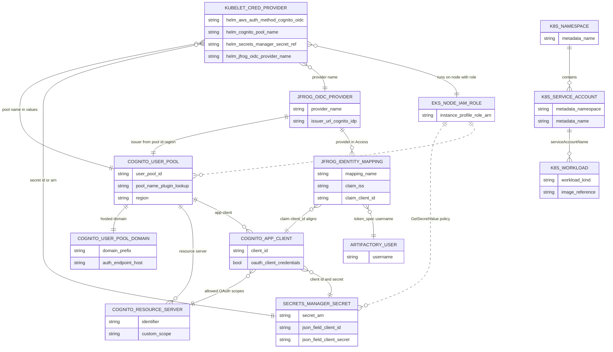

# AWS Cognito OIDC workflow — stakeholder checklist

This document summarizes **AWS services**, **JFrog Access** configuration, and **Kubernetes** concerns for the JFrog Kubelet Credential Provider when using **`aws_auth_method: cognito_oidc`**: OAuth2 **`client_credentials`** against Amazon Cognito, then OIDC token exchange with Artifactory.

It is derived from:

- `tomj-lab/aws-lab-exercise.md` (§9)
- `AWS.md` (Option B: Cognito OIDC)
- `tomj-lab/examples/aws-cognito-oidc-values.yaml`

Scope: **Cognito OIDC path only** — not the IRSA / **`assume_role`** path.

---

## Object taxonomy (entity–relationship diagram)

This is a **logical** model of objects in the **Cognito OIDC** path: Amazon **Cognito User Pools** (domain, resource server, app client), **Secrets Manager** credentials, the **EKS worker node IAM role** (IMDS-backed), **JFrog Access** OIDC configuration, and the **kubelet credential provider** Helm release. It is not a full AWS Organizations inventory.

The diagram uses Mermaid’s **`direction TB`** (top-to-bottom). **Dashed** relationships (`..` in the relationship line) mean **operational / policy access** (IAM can read many secrets or call Cognito discovery APIs per your policy shape), not a console “create wizard” parent-child in every case.

**How to read the diagram**

- **Cognito stack:** One **user pool** has a **domain** (token endpoint), **resource server** (scopes), and **app clients**. The **app client** authorized for **`client_credentials`** holds the **client id**; the **client secret** and id are mirrored in **Secrets Manager** with keys **`client-id`** and **`client-secret`** (exact names).
- **Node IAM (Cognito-only path):** The **EKS worker / EC2 instance role** uses **IMDS** to call **Secrets Manager** and **Cognito** (`ListUserPools`, `DescribeUserPool`, `ListResourceServers`, etc. per your lab policy)—**not** an IRSA pod role for this design.
- **JFrog trust:** **JFrog OIDC provider** **`issuer_url`** is `https://cognito-idp.<region>.amazonaws.com/<userPoolId>`. **Identity mappings** typically key on **`iss`** and **`client_id`** (and peers your team chooses); **`expires_in`** should exceed Helm **`defaultCacheDuration`**.
- **Kubernetes:** **`KUBELET_CRED_PROVIDER`** Helm values must align **pool name**, **secret reference**, resource server / scope, and **`jfrog_oidc_provider_name`** with Cognito + JFrog. For a **pure Cognito** sign-off workload, use a **plain** **`K8S_SERVICE_ACCOUNT`** **without** **`JFrogExchange`** and **without** **`eks.amazonaws.com/role-arn`**, or the provider may take the **IRSA / `GetCallerIdentity`** path instead.

---

## AWS services and objects (AWS administrators)

| Area                            | What you need                                                                              | Notes from the lab                                                                                                                                                                                                                      |
| ------------------------------- | ------------------------------------------------------------------------------------------ | --------------------------------------------------------------------------------------------------------------------------------------------------------------------------------------------------------------------------------------- |
| **Amazon Cognito (User Pools)** | **User pool**                                                                              | Use a stable **pool name**; the plugin resolves the pool by **name** (`ListUserPools`), not only by ID.                                                                                                                                 |
|                                 | **User pool domain** (hosted domain prefix)                                                | Required so `DescribeUserPool` returns a domain and the plugin can call `https://<prefix>.auth.<region>.amazoncognito.com/oauth2/token`. Prefix must be **unique per account/region**.                                                  |
|                                 | **Resource server**                                                                        | **Identifier**, **name**, and at least one **custom scope** (e.g. `read`). The OAuth scope sent to Cognito is `<identifier>/<scopeName>`.                                                                                               |
|                                 | **App client**                                                                             | **Client with generated secret**; after the resource server exists: **`client_credentials`** flow, **allowed OAuth scopes** matching the resource server scope, **`allowed-o-auth-flows-user-pool-client`**.                            |
| **AWS Secrets Manager**         | **Secret** (same **region** the plugin uses via instance metadata)                         | JSON body must use keys **`client-id`** and **`client-secret`** (exactly).                                                                                                                                                              |
| **AWS IAM**                     | **IAM policy** (customer-managed or equivalent) on the **EKS worker node (instance) role** | **`secretsmanager:GetSecretValue`** on the Cognito secret (ARN pattern with Secrets Manager suffix). **`cognito-idp:ListUserPools`**, **`DescribeUserPool`**, **`ListResourceServers`** (lab uses `Resource: "*"` for these read APIs). |
|                                 | **Attachment**                                                                             | Policy attached to the **node group / EC2 instance profile role**, *not* an IRSA pod role for the Cognito-only design.                                                                                                                  |
| **Amazon EC2 (implicit)**       | **Instance metadata–based credentials**                                                    | Plugin uses **IMDS** + the **node IAM role** to call Secrets Manager and Cognito APIs.                                                                                                                                                  |
| **Networking / endpoints**      | **Egress from worker nodes**                                                               | Must reach **Secrets Manager**, **Cognito** (regional user-pool/token endpoints), and **`https://<artifactory-host>`** (private clusters need NAT, VPC endpoints, or proxy as appropriate).                                             |

**Not required** for a pure Cognito lab path: **EKS IRSA** (cluster OIDC provider + federated role + `eks.amazonaws.com/role-arn` on the pulling ServiceAccount). Those belong to the **other** auth method; IRSA annotations on the workload **override** Cognito in the provider (see lab §9.7).

---

## JFrog / platform objects

Often owned separately from the AWS team.

| Object                           | Purpose                                                                                                                                                                            |
| -------------------------------- | ---------------------------------------------------------------------------------------------------------------------------------------------------------------------------------- |
| **Access API: OIDC provider**    | `POST .../access/api/v1/oidc` with Cognito **issuer** `https://cognito-idp.<region>.amazonaws.com/<userPoolId>`.                                                                   |
| **Access API: identity mapping** | Maps JWT claims (e.g. **`iss`**, **`client_id`**) to an **Artifactory username** and token settings; **`expires_in`** should exceed Helm **`defaultCacheDuration`** (lab warning). |
| **Artifactory user**             | Dedicated user for OIDC (lab recommends **not** reusing the IAM/IRSA-bound user). Docker **read** (and other repo permissions) for images under test.                              |
| **Admin access token**           | To run the Access API configuration.                                                                                                                                               |

No **`PUT .../access/api/v1/aws/iam_role`** binding is required **for Cognito-only** authentication.

---

## Kubernetes / cluster objects (Kubernetes administrators)

| Object / concern                                  | What you need                                                                                                                                                                                   |
| ------------------------------------------------- | ----------------------------------------------------------------------------------------------------------------------------------------------------------------------------------------------- |
| **EKS cluster + nodes**                           | Workers where the **kubelet credential provider** runs (standard EKS worker assumption in the lab).                                                                                             |
| **Helm release**                                  | e.g. `jfrog/jfrog-credential-provider` with `aws_auth_method: cognito_oidc` and pool / secret / resource server / scope / `jfrog_oidc_provider_name` aligned with AWS + JFrog.                  |
| **Node labels (if following the example values)** | e.g. **`credentialsProviderEnabled=true`** and supported **`kubernetes.io/arch`** — the sample `aws-cognito-oidc-values.yaml` uses **node affinity** for that.                                  |
| **Chart-installed pieces**                        | Whatever the chart deploys to register the provider with the kubelet (DaemonSet, host paths, kubelet config — per chart defaults).                                                              |
| **Test workload namespace**                       | Namespace, **Deployment**, **ServiceAccount** for pulls. For a **true Cognito** sign-off, use a **plain** ServiceAccount **without** `JFrogExchange` + **`eks.amazonaws.com/role-arn`** (§9.7). |
| **Network policies / firewalls**                  | Allow nodes toward AWS APIs + Artifactory as above.                                                                                                                                             |

---

## Viability summary (for stakeholders)

- **AWS footprint:** Cognito User Pool + domain + resource server + OAuth app client, one Secrets Manager secret, and a **small, node-role IAM policy** (plus normal node IMDS behavior). No IRSA complexity **if** you standardize on Cognito-only pulls for those workloads.
- **Operational coupling:** Node IAM must stay aligned with secret name/ARN patterns; Cognito client rotation implies updating Secrets Manager (and possibly the Artifactory identity mapping if **`client_id`** is part of the mapping).
- **Kubernetes coupling:** The **JFrog credential provider** must be installed on nodes with compatible kubelet configuration; the sample values assume **labeled nodes** for scheduling.

---

## Discovery questions for AWS and Kubernetes teams

Use these in workshops or email to surface blockers early. “Viable” here means: workers can reach AWS + Artifactory, node IAM can read the Cognito secret and call Cognito discovery APIs, Cognito can issue `client_credentials` tokens, Artifactory can accept that issuer/claims, and the cluster allows the credential provider installation pattern.

### Questions for the AWS team

1. **Cognito** — Are **Amazon Cognito User Pools** allowed in our org (region, compliance, security review)? Any preference to **reuse** an existing pool and domain vs **create** a dedicated pool for registry pulls?
2. **OAuth client model** — Are **machine-to-machine** clients using **`client_credentials`** and a **client secret** acceptable, or are they restricted in favor of other patterns?
3. **User pool domain** — Can we register a **Cognito hosted UI / user-pool domain prefix** (global uniqueness per account/region)? Any naming standard or reservation process?
4. **Resource server / scopes** — Is there an existing **resource server + custom scope** pattern we must follow, or can we define a minimal scope for this integration?
5. **Secrets Manager** — Is **AWS Secrets Manager** approved for OAuth client credentials? Any requirement for **customer-managed KMS (CMK)**, separate accounts, or **rotation** tooling that would force a new runbook when the Cognito client rotates?
6. **Secret region** — Must the secret live in the **same AWS Region as the worker nodes**? (The provider resolves region from **instance metadata**; cross-region or cross-account secrets need an explicit design.)
7. **Node IAM roles** — Which **IAM role** is attached to our **EKS managed node groups / self-managed workers / Karpenter AMIs**? Can we **attach a least-privilege policy** to that role for `secretsmanager:GetSecretValue` and the listed `cognito-idp:*` read actions, or are node roles **frozen** by a platform team?
8. **IAM guardrails** — Do **SCPs, permission boundaries, or managed-policies** block those actions from **EC2 instance principals** / node roles?
9. **IMDS** — Do we mandate **IMDSv2** or **hop limits** that could affect how software on the node obtains instance credentials? Any policy against using the **instance profile** for “side” API calls beyond pulling images?
10. **Networking** — For **private-only** nodes, is there **egress** (NAT) or **VPC interface endpoints** for **Secrets Manager**, **Cognito** (and any STS usage your baseline assumes), plus **HTTPS to our Artifactory hostname**? Any **egress firewall / proxy** that must allowlist Cognito OAuth endpoints (`*.amazoncognito.com` and regional Cognito API hosts)?
11. **Multi-account** — If EKS and Secrets Manager (or Cognito) live in **different accounts**, is **cross-account secret access** or **role chaining** already standardized for node workloads?
12. **Auditing** — What **CloudTrail / security monitoring** expectations apply to **Cognito token issuance** and **Secrets Manager reads** from node roles?

### Questions for the Kubernetes / platform engineering team

1. **Kubelet credential provider** — Does our **Kubernetes / EKS version** and **kubelet configuration** support the **kubelet credential provider** mechanism used by the **JFrog Helm chart**? Who approves changes to **kubelet flags** or drop-in config on worker nodes?
2. **Chart install model** — Can we install **`jfrog/jfrog-credential-provider`** (or equivalent manifests) via **Helm** in a nominated namespace? Any requirement for **GitOps** (Argo CD, Flux) instead of ad hoc `helm upgrade`?
3. **Node access / privileged patterns** — Does the chart’s need for **host-level** integration (e.g. **hostPath**, **DaemonSet** on all image-pulling nodes, possible **privileged** or **system-node** patterns) pass our **Pod Security Standards / OPA / Kyverno** policies?
4. **Scheduling** — Can we **label** a subset of nodes (e.g. `credentialsProviderEnabled=true`) and run pull-heavy workloads there, or must **every** image-pulling node run the provider? Any conflict with **taints, capacity types (Spot), or ARM vs x86** in `matchImages` / affinity?
5. **Baseline node AMIs** — Are workers **EKS-optimized Amazon Linux, Bottlerocket, or custom**? Has this credential provider (or similar host-installed binaries) been **approved** on that AMI family before?
6. **IRSA interaction** — If workloads already use **IRSA** (`eks.amazonaws.com/role-arn` and related annotations), do we understand that **those annotations can switch the provider to the IAM / `GetCallerIdentity` path** instead of Cognito? Can we **standardize** Cognito test workloads on **plain** ServiceAccounts for a pilot?
7. **NetworkPolicy and service mesh** — Do **default-deny** **NetworkPolicies** or a **service mesh** affect **kubelet → registry** pulls or **host-network** components used by the stack? Who validates that **image pulls still succeed** with those controls on?
8. **Private / mirrored registries** — If we use **registry mirrors** or **pull-through caches**, do **`matchImages`** patterns still invoke the credential provider as expected, or do pulls bypass it?
9. **Observability** — Can operations access **node logs** (e.g. provider log path in the lab runbook) and **kubelet events** for **ImagePullBackOff** triage during a pilot?
10. **Change windows** — What is the process to **roll** a change that touches **every node** (DaemonSet upgrade, kubelet config), and what **rollback** is required?

### Questions for the JFrog / identity team (if separate from AWS/K8s)

1. Can we register a **generic OIDC provider** in **JFrog Access** with Cognito’s **`iss`**, and add an **identity mapping** on **`iss` + `client_id`** (or the claims your security team prefers)?
2. Can we use a **dedicated Artifactory user** for Cognito-mapped tokens (separate from any **IAM role–bound** user used elsewhere)?
3. Can we set **token lifetime** (`expires_in` / **Access** mapping) **longer** than the credential provider’s **cache duration** so clients are not handed near-expired registry tokens?

### Follow-up: what “yes” looks like

- AWS: Cognito + Secrets Manager **provisioned**, node role **policy attached**, **egress** proven from a **representative worker** to Cognito, Secrets Manager, and **Artifactory HTTPS**.
- Kubernetes: **Provider installed** on pilot nodes, **workloads** use the intended **ServiceAccount** shape (no accidental IRSA override if you want Cognito).
- JFrog: **OIDC provider + mapping** live, test user can **read** a **pilot repository**.

