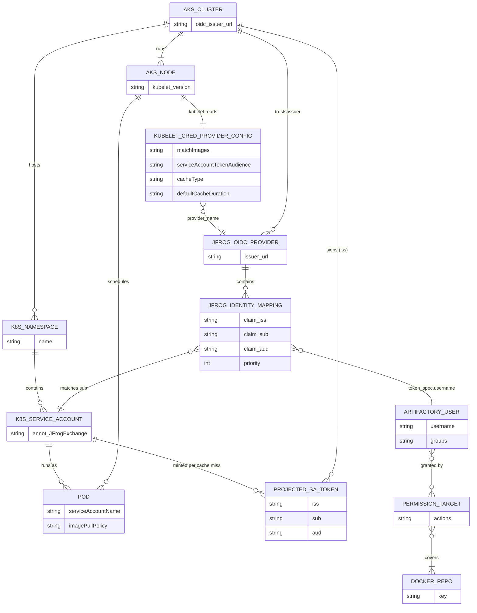
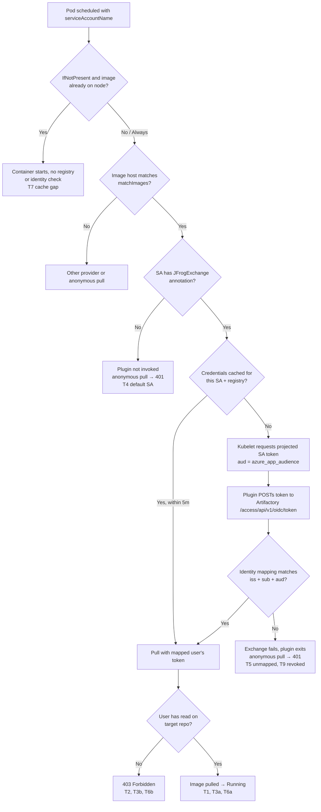

# Azure Workload Identity OIDC workflow — stakeholder checklist (1.4.0 Option B)

**Updated for JFrog credential provider 1.4.0:** projected Kubernetes service account tokens go **directly** to Artifactory. **No** Entra app registration, **no** federated credentials, **no** `azure.workload.identity/client-id` annotation.

Lab runbook: [tomj-lab/azure-wi-isolation-lab.md](./tomj-lab/azure-wi-isolation-lab.md). Evidence: [tomj-lab/azure-wi-isolation-evidence.md](./tomj-lab/azure-wi-isolation-evidence.md).

Legacy Entra-centric checklist content referred to pre-1.4.0 behavior; see git history before upstream merge.

---

## Object taxonomy (simplified)

Full inventory with cardinalities: [tomj-lab/azure-wi-object-inventory.md](./tomj-lab/azure-wi-object-inventory.md).

## Evaluated pull flow (lab, 2026-09-28)

---

## Azure / platform administrators

| Area | Requirement |
|------|-------------|
| AKS | `--enable-oidc-issuer` (and historically WI flag; 1.4.0 path does not use Entra WI exchange for pulls) |
| Issuer URL | Record `oidcIssuerProfile.issuerUrl` exactly (trailing slash) for JFrog `iss` |
| Egress | Nodes reach `tomjpd2.jfrog.io` (or customer Artifactory) and cluster OIDC discovery |
| Entra | **Not required** for Option B 1.4.0 |

## JFrog administrators

| Object | Requirement |
|--------|-------------|
| OIDC provider | `issuer_url` / `token_issuer` = AKS OIDC issuer |
| Identity mapping | Match `iss`, `sub` (`system:serviceaccount:<ns>:<sa>`), `aud` (must equal Helm `azure_app_audience`; a dedicated value such as **`jfrog-artifactory`** needs an extra node RBAC rule and a DaemonSet restart — see [AZURE.md Step 4B](./AZURE.md#step-4b-workload-identity--projected-service-account-tokens-no-app-registration)) |
| Artifactory user | Per team/namespace; repo permissions **without** global `readers` if testing isolation |
| Token TTL | `expires_in` > provider `defaultCacheDuration` |

## Kubernetes administrators

| Object | Requirement |
|--------|-------------|
| Helm chart | `jfrog/jfrog-credential-provider` ≥ 1.4.0, `tokenAttributes.enabled: true` |
| ServiceAccount | `JFrogExchange: "true"` on pulling workloads |
| Pods | `serviceAccountName` set; `imagePullPolicy: Always` for isolation tests on shared nodes |
| Provider | DaemonSet on all pulling nodes; verify merged kubelet credential provider YAML |

---

## Discovery questions (customer workshop)

### Azure / AKS

1. AKS version and support for kubelet credential provider + projected SA tokens?
2. Shared nodepools across tenants or dedicated nodepools?
3. Egress to Artifactory and to AKS OIDC issuer from nodes?

### Kubernetes

1. Admission policy for `imagePullPolicy: Always` on tenant workloads?
2. RBAC model: who can create pods / tokens in each namespace?
3. GitOps approval for Helm DaemonSet on nodes?

### JFrog

1. Accept cluster OIDC issuer as provider (Azure vs Generic type)?
2. Identity mapping: exact `sub` only vs namespace wildcard — what does your Access version support?
3. Default `readers` group membership for new users?

---

## Viability (honest)

- **Promising:** 1.4.0 removes Entra scaling limits; workload identity in JFrog is **`sub`-driven**.
- **Unproven until tested:** Same-node cross-namespace pull denial (T6), node image cache (T7), mapping wildcards.
- **Not a plugin feature:** Node-level cache and cluster RBAC boundaries.
