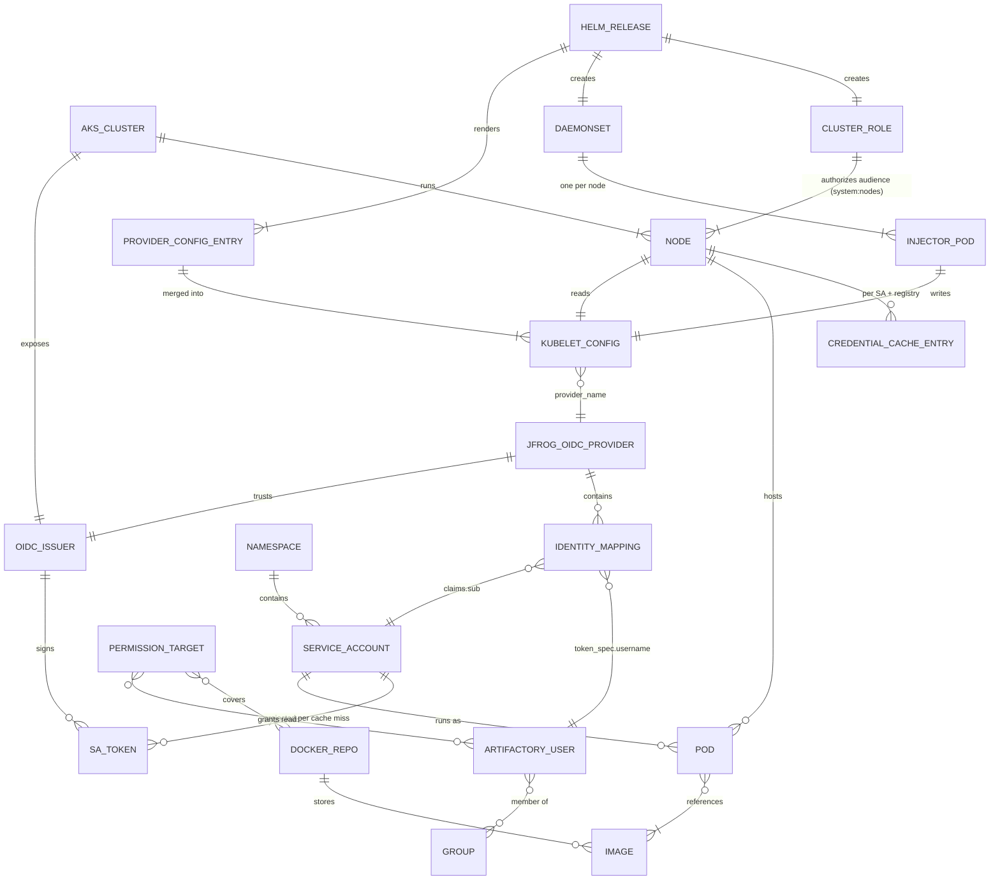

# Object inventory — AKS projected SA tokens → JFrog (Option B, 1.4.0)

Every object that participates in an image pull, what role it plays, and how it relates to the others. Lab values are from `tomj-k8s-cluster` + `tomjpd2.jfrog.io` (verified live 2026-09-28).

**Notation:** `1` = exactly one, `0..1` = optional single, `n` = many, `1..n` = at least one. "Per X" means the count scales with X.

---

## 1. Azure / AKS control plane

| # | Object | Role in the flow | Key fields | Lab value | Quantity |
|---|--------|------------------|------------|-----------|----------|
| A1 | **Azure tenant / subscription / resource group** | Hosting only. No identity role in Option B. | — | `tomj-jfrog-credentials-provider-lab-rg` | 1 RG → n clusters |
| A2 | **AKS cluster** | Owns the service account signing keys and the OIDC issuer. Root of trust for the whole flow. | `oidcIssuerProfile.enabled`, version | `tomj-k8s-cluster`, control plane 1.35.1 | 1 per environment |
| A3 | **Cluster OIDC issuer** (URL + discovery doc + JWKS) | Public endpoint Artifactory fetches to verify SA token signatures. Its URL becomes the token's `iss`. | `issuerUrl` (trailing slash matters) | `https://centralus.oic.prod-aks.azure.com/<tenant>/<cluster-guid>/` | **1 per cluster** (unique; not shared across clusters) |
| A4 | **Node pool** (VMSS) | Groups nodes. Only relevant for scheduling and for shared vs. dedicated node isolation. | — | `agentpool` | 1 cluster → 1..n pools |
| A5 | **Node** (VM) | Runs kubelet, the plugin binary, and the local image cache. | kubelet version (≥ 1.34 for SA tokens to plugins) | 2 × `aks-agentpool-42574423-vmss00000{0,1}`, v1.34.4 | 1 pool → 1..n nodes |

---

## 2. Kubernetes objects installed by the Helm chart (platform team)

| # | Object | Role in the flow | Key fields | Lab value | Quantity |
|---|--------|------------------|------------|-----------|----------|
| K1 | **Helm release** | Packages everything below. | chart version, values | `jfrog-cp`, chart 1.4.0, rev 2 | 1 per cluster |
| K2 | **`providerConfig[]` entry** (Helm values) | One logical credential provider: which registry hosts, which audience, which JFrog OIDC provider. | `artifactoryUrl`, `matchImages`, `defaultCacheDuration`, `tokenAttributes.enabled`, `azure.azure_app_audience`, `azure.jfrog_oidc_provider_name` | 1 entry: `tomjpd2.jfrog.io`, `5m`, aud `jfrog-artifactory` (values) | 1 release → 1..n entries (all must be the same cloud) |
| K3 | **Provider ConfigMap** (`…-config`) | Holds the rendered `jfrog-provider.yaml` that gets merged into each node's kubelet config. | `jfrog-provider.yaml` | `jfrog-cp-jfrog-credential-provider-config` | 1 per release |
| K4 | **Setup ConfigMap** (`…-setup`) | Holds `setup.sh`: downloads the binary, merges kubelet config, restarts kubelet. | `setup.sh` | `jfrog-cp-jfrog-credential-provider-setup` | 1 per release |
| K5 | **DaemonSet** | Delivers the plugin to every node. **Not restarted automatically when K3 changes.** | nodeSelector/affinity, tolerations | `jfrog-cp-jfrog-credential-provider-daemonset` | 1 per release |
| K6 | **DaemonSet pod** (init container `jfrog-credential-provider-injector` + pause/log container) | Runs `setup.sh` once on its node (privileged, host mount `/var/lib/kubelet`), then idles. | start time = when node config was last written | 2 pods | **1 per eligible node** |
| K7 | **DaemonSet ServiceAccount** | Identity of the injector pod only. **Not used for image pulls.** | — | `jfrog-cp-jfrog-credential-provider` | 1 per release |
| K8 | **ClusterRole** | Authorizes nodes to request SA tokens for the configured audience, create SA tokens, read SAs. | `request-serviceaccounts-token-audience` on `api://AzureADTokenExchange` (hard-coded); `serviceaccounts/token: create`; `serviceaccounts: get,list`; `rbac.role.additionalRules` | Only `api://AzureADTokenExchange` granted | 1 per release |
| K9 | **ClusterRoleBinding** | Binds K8 to the group `system:nodes` (every kubelet). | subject `Group system:nodes` | — | 1 per release → all nodes |

---

## 3. Node-level objects (written by the DaemonSet, consumed by kubelet)

| # | Object | Role in the flow | Key fields | Lab value | Quantity |
|---|--------|------------------|------------|-----------|----------|
| N1 | **Kubelet** | Decides whether to call the plugin, requests the SA token, caches credentials, performs the pull. | — | — | 1 per node |
| N2 | **Kubelet credential provider config** (`/var/lib/kubelet/credential-provider-config.yaml`) | Tells kubelet which plugin handles which registry and how to project tokens. | per provider: `matchImages`, `defaultCacheDuration`, `tokenAttributes.serviceAccountTokenAudience`, `cacheType: ServiceAccount`, `requireServiceAccount: true`, `requiredServiceAccountAnnotationKeys: [JFrogExchange]`, `env` | Contains `acr-credential-provider` (AKS built-in) **and** `jfrog-credentials-provider`; audience on nodes = `api://AzureADTokenExchange` | 1 per node → n provider entries (1 per K2 + built-ins) |
| N3 | **Plugin binary** (`/var/lib/kubelet/credential-provider/jfrog-credentials-provider`) | Stateless executable kubelet runs on each cache miss; exchanges the SA token with Artifactory. | arch suffix `-amd64`/`-arm64` | v1.4.0 | 1 per node per K2 entry |
| N4 | **Plugin process invocation** | Short-lived process: reads `CredentialProviderRequest` on stdin, writes `CredentialProviderResponse` on stdout. | — | ~1.8 s end-to-end on positive pulls | 1 per (SA × registry) cache miss |
| N5 | **Plugin log** (`/var/log/jfrog-credentials-provider/…log`) | Troubleshooting only. | `log_level` | `debug` | 1 per node |
| N6 | **Kubelet credential cache entry** | Holds username/token so repeat pulls skip the plugin. Keyed by **service account + registry** (`cacheType: ServiceAccount`; plugin returns `cacheKeyType: Registry`). | TTL = `defaultCacheDuration` (plugin returns no override) | 5 m | **1 per (node × SA × registry)** |
| N7 | **Node image cache** (containerd) | Stores pulled layers. Shared by every pod on the node regardless of SA. With `IfNotPresent`, a cached image starts without any registry/identity check (**T7 gap**). | — | — | 1 per node → n images |

---

## 4. Tenant / workload objects (app teams)

| # | Object | Role in the flow | Key fields | Lab value | Quantity |
|---|--------|------------------|------------|-----------|----------|
| W1 | **Namespace** | Tenancy boundary; second segment of `sub`. | name | `team-a`, `team-b`, `team-c` (unmapped) | 1 cluster → n |
| W2 | **ServiceAccount (pull identity)** | **The workload identity JFrog sees.** Opt-in via annotation. | annotation `JFrogExchange: "true"` (required; otherwise plugin is skipped). **No** `azure.workload.identity/*` annotations. | `artifactory-pull` in each team namespace | 1 namespace → n SAs (lab: 1) |
| W3 | **Pod** | Consumer. Selects the identity via `serviceAccountName`; `imagePullPolicy` controls whether the registry is re-checked. | `serviceAccountName`, `imagePullPolicy`, `image` | `pull-team-a-own`, `pull-team-b-cross`, … | 1 SA → n pods; each pod → exactly 1 SA |
| W4 | **Container image reference** | Its host must match `matchImages`; its repo path selects the Artifactory repo that permissions are checked against. | `<host>/<repo>/<image>:<tag>` | `tomjpd2.jfrog.io/team-a-docker-local/alpine:wi-lab-amd64` | 1 pod → 1..n images |
| W5 | **Default ServiceAccount** | Negative case: lacks `JFrogExchange`, so kubelet never calls the plugin → anonymous pull → **401** (T4). | — | `default` | 1 per namespace (auto-created) |

---

## 5. JFrog Platform objects

| # | Object | Role in the flow | Key fields | Lab value | Quantity |
|---|--------|------------------|------------|-----------|----------|
| J1 | **JFrog Platform instance** | Hosts Access (token exchange) and Artifactory (registry). | URL | `tomjpd2.jfrog.io` | 1 |
| J2 | **OIDC provider** (Access) | Trust anchor: "tokens signed by this cluster's issuer are acceptable." Named by `jfrog_oidc_provider_name` in the plugin's request. | `name`, `issuer_url`, `token_issuer`, `provider_type: Azure`, `enable_permissive_configuration` | `aks-wi-lab-oidc`, issuer = A3, permissive = `true` | **1 per cluster issuer** (n clusters → n providers) |
| J3 | **Identity mapping** | Authorization rule: "a token with these claims becomes this Artifactory user." Exact-`sub` mapping ⇒ one SA. | `claims.iss`, `claims.sub`, `claims.aud`, `priority`, `token_spec.username`, `token_spec.scope`, `token_spec.audience`, `token_spec.expires_in` | `mapping-team-a-jfrog-aud`, `mapping-team-b-jfrog-aud` (aud `jfrog-artifactory`, priority 5); legacy `mapping-team-b-artifactory-pull` (aud `api://AzureADTokenExchange`, priority 10) still present | 1 provider → n mappings; **1 mapping per SA** with exact `sub` (wildcards not validated) |
| J4 | **Artifactory user** | The principal whose permissions govern the pull. Must exist before mapping. | `groups` — must **not** include `readers` for isolation | `aks-team-a-puller`, `aks-team-b-puller` (groups = []) | n mappings → 1 user (many SAs *may* share a user); 1 per team in lab |
| J5 | **Group** (e.g. `readers`) | Optional aggregation of permissions. The default `readers` group grants read on everything and silently breaks repo isolation. | members | Lab users removed from `readers` | 1 user → 0..n groups |
| J6 | **Permission target** | Grants read on specific repos to specific users/groups. This is what produces **403** on cross-team pulls. | `repositories`, `principals.users`, actions (`r`) | `aks-wi-lab-team-a` → `team-a-docker-local` → `aks-team-a-puller` | n ↔ n with users/groups; n ↔ n with repos (lab: 1:1:1) |
| J7 | **Docker repository** | Where images live. Second segment of the image path. | repo key, type (local/remote/virtual) | `team-a-docker-local`, `team-b-docker-local` | 1 per team in lab; 1 repo → n images |
| J8 | **Image / tag** | The artifact being pulled. | tag, digest, platform | `alpine:wi-lab-amd64` (linux/amd64) in both repos | 1 repo → n images |

---

## 6. Runtime artifacts (tokens and messages)

| # | Artifact | Produced by → consumed by | Contents | Lifetime | Quantity |
|---|----------|---------------------------|----------|----------|----------|
| T1 | **Projected SA token** (JWT) | API server (signed with cluster key) → kubelet → plugin → Artifactory | `iss` = A3, `sub` = `system:serviceaccount:<ns>:<sa>`, `aud` = `azure_app_audience`, `kubernetes.io.{namespace, serviceaccount, pod, node}` | Short (TokenRequest default) | 1 per cache miss (per SA × registry × node) |
| T2 | **CredentialProviderRequest** | kubelet → plugin (stdin) | `image`, `serviceAccountToken`, `serviceAccountAnnotations` (only listed keys: `JFrogExchange`, `azure.workload.identity/client-id`) | One call | 1 per invocation |
| T3 | **OIDC token-exchange request** | plugin → `POST /access/api/v1/oidc/token` | `grant_type: token-exchange`, `provider_name` = J2, `subject_token` = T1, `audience` = `jfrog_token_audience` (default `*@*`) | One call | 1 per invocation |
| T4 | **Artifactory access token** | Access → plugin → kubelet | `username` = J3 `token_spec.username`, scope `applied-permissions/user`, `expires_in` from mapping | 3600 s (must exceed `defaultCacheDuration`) | 1 per successful exchange |
| T5 | **CredentialProviderResponse** | plugin → kubelet (stdout) | `cacheKeyType: Registry`, `auth[<registry host>] = {username, password=T4}` | Cached per N6 | 1 per invocation |
| T6 | **Registry pull request** | kubelet/containerd → Artifactory Docker API | Basic auth with T4 | One pull | 1 per image pull that isn't served from N7 |

---

## 7. Relationship catalog (for drawing connectors)

| From | Relationship | To | Cardinality (From : To) | Enforced by |
|------|--------------|----|-------------------------|-------------|
| AKS cluster (A2) | exposes | OIDC issuer (A3) | 1 : 1 | AKS |
| AKS cluster (A2) | contains | Node pool (A4) | 1 : 1..n | AKS |
| Node pool (A4) | contains | Node (A5) | 1 : 1..n | AKS |
| Helm release (K1) | renders | `providerConfig` entry (K2) | 1 : 1..n | Helm |
| Helm release (K1) | creates | DaemonSet (K5), ConfigMaps (K3, K4), ClusterRole (K8), ClusterRoleBinding (K9), SA (K7) | 1 : 1 each | Helm |
| DaemonSet (K5) | schedules | Injector pod (K6) | 1 : 1 per eligible node | Kubernetes |
| Injector pod (K6) | writes | Kubelet config (N2) + plugin binary (N3) on its node | 1 : 1 | `setup.sh` |
| `providerConfig` entry (K2) | becomes | Provider entry in kubelet config (N2) | 1 : 1 per node | `add-provider-config` merge |
| ClusterRoleBinding (K9) | grants ClusterRole (K8) to | Every node's kubelet (N1) via `system:nodes` | 1 : all nodes | Kubernetes RBAC |
| ClusterRole (K8) | authorizes | Token audience | 1 : 1..n audiences (chart: 1, `api://AzureADTokenExchange`) | NodeRestriction / node authorizer |
| Namespace (W1) | contains | ServiceAccount (W2) | 1 : n | Kubernetes |
| ServiceAccount (W2) | used by | Pod (W3) | 1 : n (each pod has exactly 1 SA) | Kubernetes |
| Node (A5) | runs | Pod (W3) | 1 : n | Scheduler |
| Pod (W3) | references | Image (W4) | 1 : 1..n | Pod spec |
| ServiceAccount (W2) | yields | Projected SA token (T1) | 1 : n over time (1 per cache miss per node) | Kubelet TokenRequest |
| OIDC issuer (A3) | signs / is `iss` of | Projected SA token (T1) | 1 : n | API server |
| OIDC provider (J2) | trusts | OIDC issuer (A3) | 1 : 1 | `issuer_url` |
| Kubelet config provider entry (N2) | names | OIDC provider (J2) | n : 1 | `jfrog_oidc_provider_name` env |
| OIDC provider (J2) | contains | Identity mapping (J3) | 1 : n | Access |
| Identity mapping (J3) | matches | ServiceAccount (W2) | 1 : 1 with exact `sub` (1 : n only with unvalidated wildcards) | `claims.sub` |
| Identity mapping (J3) | requires | Token audience | 1 : 1 | `claims.aud` must equal `azure_app_audience` |
| Identity mapping (J3) | issues token as | Artifactory user (J4) | n : 1 | `token_spec.username` |
| Artifactory user (J4) | member of | Group (J5) | n : n (lab: 0) | Access |
| Permission target (J6) | grants read to | User (J4) / Group (J5) | n : n (lab: 1 : 1) | Artifactory |
| Permission target (J6) | covers | Docker repository (J7) | n : n (lab: 1 : 1) | Artifactory |
| Docker repository (J7) | stores | Image (J8) | 1 : n | Artifactory |
| Image reference (W4) | resolves to | Docker repository (J7) + Image (J8) | n : 1 | Image path |
| Credential cache entry (N6) | keyed by | ServiceAccount (W2) × registry host | 1 : 1 pair, per node | `cacheType: ServiceAccount` |
| Node image cache (N7) | shared by | All pods / SAs on the node | 1 : n | containerd |

**End-to-end chain (one line for a slide):** Pod → ServiceAccount (`JFrogExchange`) → kubelet on Node → projected token signed by the cluster OIDC issuer → plugin → JFrog OIDC provider (trusts the issuer) → identity mapping (`iss`+`sub`+`aud`) → Artifactory user → permission target → Docker repo → image.

**Isolation lives in exactly two places:** the identity mapping (which SA becomes which user) and the permission target (which user can read which repo). Everything on the Kubernetes side only carries identity, it does not authorize.

---

## 8. Objects deliberately **not** used in Option B

Show these greyed out or omitted, so the audience doesn't assume Entra is involved.

| Object | Why it's absent |
|--------|-----------------|
| Entra ID app registration / service principal | Artifactory trusts the cluster issuer directly |
| Federated identity credential (20-per-identity limit) | No Entra token exchange |
| User-assigned managed identity / kubelet identity | Node identity not used for JFrog |
| Azure IMDS (`169.254.169.254`) | Not called when `JFrogExchange: "true"` |
| `azure.workload.identity/client-id` annotation, WI mutating webhook | Kubelet projects the token itself; annotation is passed through but ignored |
| `imagePullSecrets` / Kubernetes Secrets | Credentials live only in kubelet memory (N6) |

---

## 9. Lab state caveats that affect the picture (verified 2026-09-28)

- **Audience drift:** Helm values and the ConfigMap say `jfrog-artifactory`, but both nodes' kubelet config still says `api://AzureADTokenExchange` because the DaemonSet pods were never restarted after rev 2. Kubelet pulls in the lab matched the **legacy** mappings.
- **Node RBAC for a custom audience:** the chart's ClusterRole (K8) only authorizes `api://AzureADTokenExchange`. Using `jfrog-artifactory` on nodes needs an `rbac.role.additionalRules` entry before restarting the DaemonSet.
- **Mapping leftovers:** `mapping-team-b-artifactory-pull` (legacy audience) still exists; team-a's legacy mapping was deleted in T9. Right now team-a kubelet pulls of uncached images would fail and team-b's would succeed.
- `enable_permissive_configuration: true` is set on the OIDC provider (J2); confirm what it relaxes before presenting it as the recommended configuration.

---

## Reference diagram

